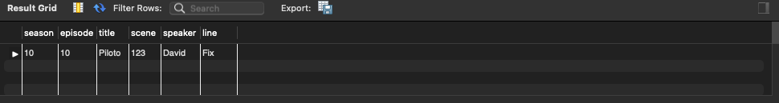

# Project-4

# Goals
For this project the goal is make a sql database and through python make a localpage with different endpoints to get and post information related with this database

##  Main Endpoint page for the API query:
    http://127.0.0.1:9000

    main page of the project with some link to other endpoints and README

## Endpoint to get all:

    http://127.0.0.1:9000/all

this return everything on the table in sql 

##  Endpoint to get all from 1 character:

    http://127.0.0.1:9000/<name>

This Endpoint return all about 1 character of the series

    
##  Endpoint all lines from one character:

    http://127.0.0.1:9000/lines/<name>

Returns all lines from 1 character selected
    
##  Endpoint for sentiment from 1 character:

    http://127.0.0.1:9000/sa/<name>

This its returns a number that is the sentimental analysis from this character 
    
##  Endpoint to post :
    http://127.0.0.1:9000/add
This endpoint allow us to save directly new info on the database

  
